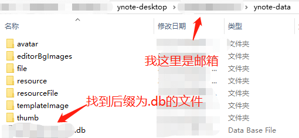

## mindmap和xmind互相转换

在网上找到了2个库,一个是官方原版,适用python2  
https://github.com/xmindltd/xmind-sdk-python  
另一个是网友改后的,适用python3  
https://github.com/jmoraleda/xmind-sdk-python3  

本项目是将`xmind-sdk-python3/xmind`复制到`xmind`来使用,  
也可以`cd`到对应目录执行`python setup.py install`安装后使用。  

## ~~有道云笔记转xmind,新版不适用~~
首先找到有道云笔记的名称,如下图所示文件名为`测试xmind.mindmap`  

然后用`everything`等文件查找工具搜索到该文件  

最后执行如下指令可以将有道云笔记转换为xmind文件  
`python mindmap.py C:\Users\xxx\AppData\Local\YNote\Data\xxx\971071D81A974521A5E1B0B73D7CC9F2\测试xmind.mindmap save.xmind`

我用`pyinstaller -F mindmap.py`将`python`代码打包成可执行文件,因此也可以用下面命令生成  
`mindmap.exe C:\Users\xxx\AppData\Local\YNote\Data\xxx\971071D81A974521A5E1B0B73D7CC9F2\测试xmind.mindmap save.xmind`

查看效果

## 新版有道云笔记转xmind
我用的是`7.0.11`版本的有道云笔记，此时无法用`everything`找到文件名

通过有道云笔记设置，如下图所示可以打开配置文件夹

然后再找到有道云笔记的数据库文件`xxx.db`

然后执行如下命令可以将所有`%.mindmap`转换到`save.xmind`中  
可以看到我用了sql通配符`%`,因此下面会将所有有道脑图转换到一个xmind中

`python mindmap_new.py "C:\Users\xxx\AppData\Roaming\ynote-desktop\your_name@163.com\ynote-data\your_name@163.com.db" "%.mindmap" save.xmind`

## 基于go语言编译可执行程序版本
最近有需求要可执行程序,正好验证我之前的[xmind](https://github.com/jan-bar/xmind)库

最新版`7.2.5`太鸡贼了,数据库里面`entryPath`列现在全是null了,不过我还是有方案

可以查看这个go语言版本[main.go](mindmap_to_xmind/main.go),可执行程序也提交到仓库了

提供两个版本: [window](mindmap_to_xmind/mindmap.exe),[linux](mindmap_to_xmind/mindmap.linux)

源码和方案都有了,后面有道云笔记官方再怎么变化方案,相信大家都有办法了

### **特别注意**
没有在有道云笔记中查看过的脑图，本地是不会生成`mindmap`文件！  
所以看到上面的结果没有转换你要的脑图，只需要在有道云笔记中打开查看一次即可

## xmind转有道云笔记
这一块我用go语言实现，因为xmind实际就是一个zip压缩包，只需要解析其中content.xml然后生成有道云笔记的json就可以。  
然后将结果覆盖有道云笔记已经生成的文件，最好在有道云笔记中编辑一下，触发保存功能。

下面是将`save.xmind`标题为`test.mindmap`的xmind保存为`xxx.mindap`文件中

`go run golang\main.go save.xmind xxx.mindap test.mindmap`

如果不带上最后一个参数则只会转换第一个sheet

`go run golang\main.go save.xmind xxx.mindap`

将`xxx.mindap`替换上面python中的文件，然后在有道云笔记中简单修改一下再保存就可以同步到服务器上了。

## 总结
有道云笔记将脑图导出为xmind是会员功能,我也不知道有道云笔记的导出和我这里的转换有啥不一样,能凑合用就行。
