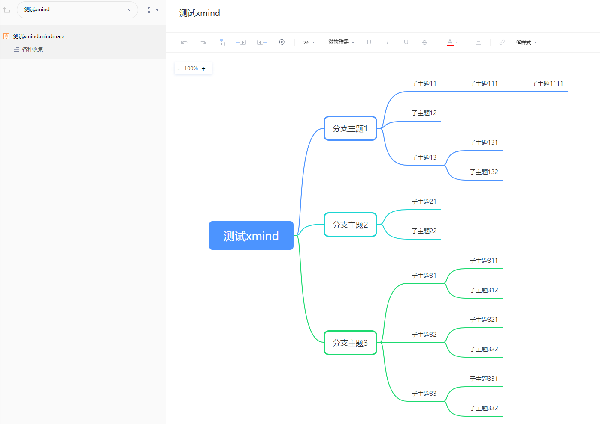
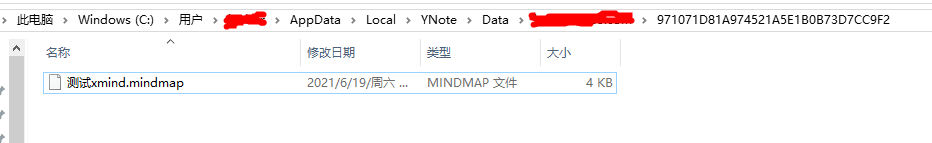
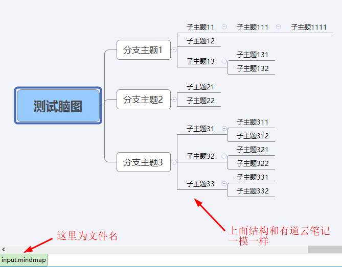

## mindmap和xmind互相转换

在网上找到了2个库,一个是官方原版,适用python2  
https://github.com/xmindltd/xmind-sdk-python  
另一个是网友改后的,适用python3  
https://github.com/jmoraleda/xmind-sdk-python3  

本项目是将`xmind-sdk-python3/xmind`复制到`xmind`来使用,  
也可以`cd`到对应目录执行`python setup.py install`安装后使用。  

## 有道云笔记转xmind
首先找到有道云笔记的名称,如下图所示文件名为`测试xmind.mindmap`  

然后用`everything`等文件查找工具搜索到该文件  

最后执行如下指令可以将有道云笔记转换为xmind文件  
`python mindmap.py C:\Users\xxx\AppData\Local\YNote\Data\xxx\971071D81A974521A5E1B0B73D7CC9F2\测试xmind.mindmap save.xmind`

我用`pyinstaller -F mindmap.py`将`python`代码打包成可执行文件,因此也可以用下面命令生成  
`mindmap.exe C:\Users\xxx\AppData\Local\YNote\Data\xxx\971071D81A974521A5E1B0B73D7CC9F2\测试xmind.mindmap save.xmind`

查看效果

## xmind转有道云笔记
这一块我用go语言实现，因为xmind实际就是一个zip压缩包，只需要解析其中content.xml然后生成有道云笔记的json就可以。  
然后将结果覆盖有道云笔记已经生成的文件，最好在有道云笔记中编辑一下，触发保存功能。

## 总结
有道云笔记将脑图导出为xmind是会员功能,我也不知道有道云笔记的导出和我这里的转换有啥不一样,能凑合用就行。
